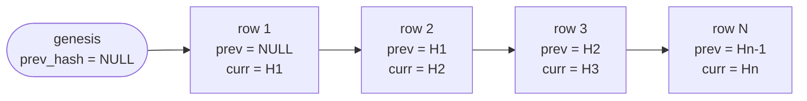
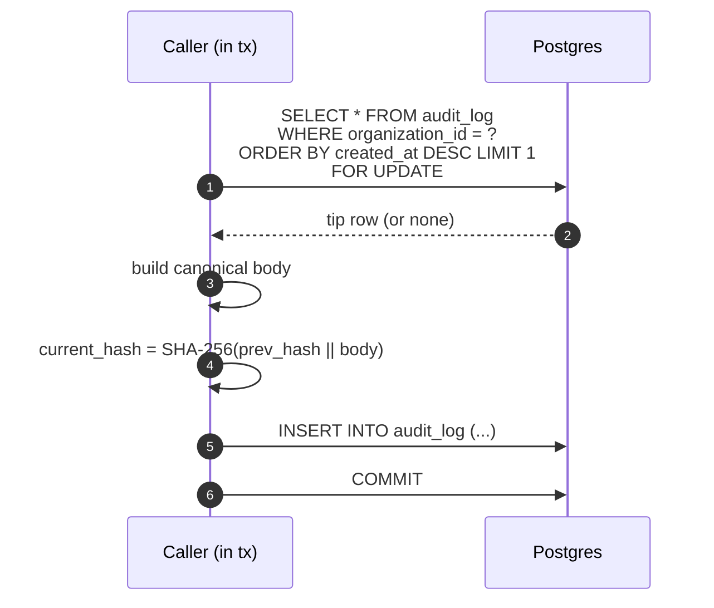
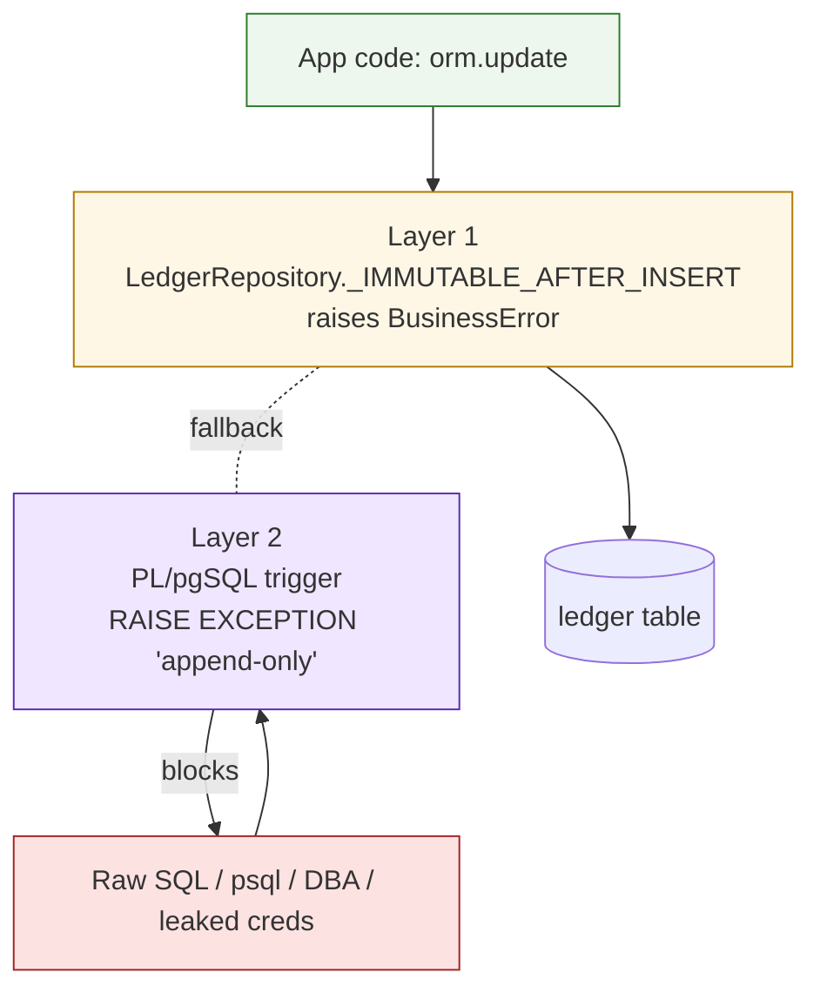
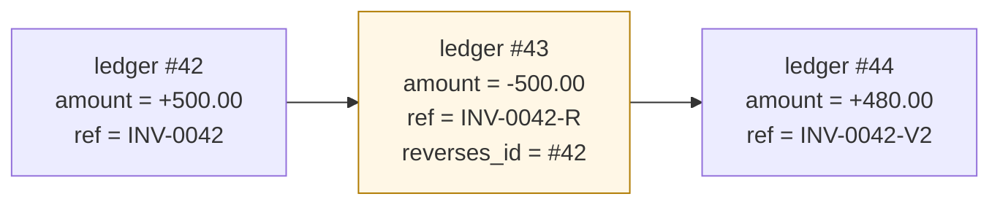

# tamper-evident-ledger

> A working demo of **tamper-evident audit logging** for financial and
> compliance systems. SHA-256 hash chain · AES-256-GCM field encryption ·
> PL/pgSQL append-only triggers · FastAPI · SQLModel · async Postgres.

Designed to drop into your own backend: each piece (chain, encryption,
repository guard, trigger) lives in its own module and has no hidden
dependencies on the rest.

---

## The money shot

Four commands. The first three pass, the fourth fails — on purpose.

```bash
make up         # postgres + alembic upgrade head
make seed       # OK  10 entries inserted, chain valid (10 rows, 0.0042s)
make verify     # OK  Chain valid (10 records, 0.0031s)
make tamper     # OK  Tamper applied to both ledger and audit_log.
                #     (raw SQL with the BEFORE UPDATE trigger disabled)

make verify     # FAIL Chain broken at row #5 (body_mismatch)
                #      expected current_hash (body edited): 9a3b...
                #      actual   current_hash (body edited): 2c81...
```

What `make tamper` actually does — in one transaction, as a superuser:

1. `SET LOCAL session_replication_role = replica` — disables all user
   triggers (so the `BEFORE UPDATE` guards from migration 002 don't fire).
2. `UPDATE ledger SET amount = ... WHERE id = row5_id` — edits the
   business record.
3. `UPDATE audit_log SET body = ... WHERE id = row5_audit_id` — rewrites
   the matching audit body to "cover the tracks".

After both edits, the ledger and the audit log *agree* on the new (false)
amount. Every other defence has been bypassed. But the **chain** still
catches it: changing the audit body changes what its `current_hash`
should be, so `verify_chain` recomputes a different hash than what's
stored. That's the property the demo is showing off.

That's the demo. The rest of this README explains *why* every line above
matters, and where you'd plug each piece into a real backend.

---

## The problem

Most teams audit "by writing to a logs table." That is **not sufficient**
when the threat includes privileged users:

- A DBA can edit any row. Including the audit log.
- A leaked service-account credential can issue `UPDATE` directly.
- A compromised admin tool can rewrite history through the ORM.

A traditional audit log records *intent*, but its own bytes have no special
status — anyone who can write to the DB can rewrite the log too.

You need **tamper-evidence**: a property that says *"if anyone changed
anything, we can prove it and pinpoint where."* That's what a hash chain
gives you. Each row's hash is computed over the previous row's hash plus
its own body — so a single edit invalidates every link from that point
onwards, and the next time anyone verifies the chain, the breakage is
obvious.

---

## How it works



```
current_hash = SHA-256( prev_hash || canonical_json(body) )
```

`canonical_json` strips every encoder freedom — sorted keys, no whitespace,
deterministic stringification of `UUID` / `Decimal` / `datetime`. Two
servers running the same code on the same body produce **the same bytes**.

To append a row safely under concurrency:



`SELECT ... FOR UPDATE` on the chain tip is what stops two parallel writers
from forking the chain. Once one writer holds the lock, the other waits
until the new tip is visible.

See [`app/audit/chain.py`](app/audit/chain.py) for the full implementation
(~120 lines, no magic).

---

## Two layers of defence

The chain *detects* tampering. But it's still better to **prevent** it when
you can. The repo ships with two enforcement layers on top of the chain:



**Layer 1 — Python `LedgerRepository`**
([`app/repositories/ledger.py`](app/repositories/ledger.py))

```python
class LedgerRepository:
    _IMMUTABLE_AFTER_INSERT: frozenset[str] = frozenset({"amount", "currency", "ref"})

    def update(self, row: Ledger, changes: dict[str, Any]) -> Ledger:
        illegal = set(changes) & self._IMMUTABLE_AFTER_INSERT
        if illegal:
            raise BusinessError(
                "Immutable fields on ledger; use the reversal flow instead",
                detail={"immutable_fields": sorted(illegal)},
            )
        for key, value in changes.items():
            setattr(row, key, value)
        return row
```

Fast, gives a friendly error with the offending field names, and keeps app
code honest. **But anyone bypassing this layer (raw SQL, a DBA session, a
compromised service) still reaches the DB.**

**Layer 2 — PL/pgSQL trigger**
([`migrations/alembic/versions/002_append_only_triggers.py`](migrations/alembic/versions/002_append_only_triggers.py))

```sql
CREATE OR REPLACE FUNCTION prevent_ledger_amount_update() RETURNS trigger AS $$
BEGIN
    IF NEW.amount IS DISTINCT FROM OLD.amount
       OR NEW.currency IS DISTINCT FROM OLD.currency
       OR NEW.ref IS DISTINCT FROM OLD.ref
    THEN
        RAISE EXCEPTION
            'ledger append-only: amount/currency/ref are immutable; use a reversal row (ledger %)',
            OLD.id
            USING ERRCODE = 'check_violation';
    END IF;
    RETURN NEW;
END;
$$ LANGUAGE plpgsql;

CREATE TRIGGER trg_ledger_append_only
BEFORE UPDATE ON ledger
FOR EACH ROW EXECUTE FUNCTION prevent_ledger_amount_update();
```

This fires inside the database itself. It catches every code path that
reaches `ledger` — ORM, raw SQL, ad-hoc `psql`, scripts, future microservices.
The only way past it is `SET session_replication_role = replica`, which
requires superuser. Which is exactly what `scripts/tamper.py` does, on
purpose, to demonstrate the chain catches what the trigger doesn't.

`audit_log` itself gets the same treatment — its trigger raises on **any**
`UPDATE` or `DELETE`, period.

---

## Reversal flow — how you "edit" an immutable row

You don't. You insert a reversing row.



The original (#42) is never touched — every audit log entry, every
external invoice reference, every report that already cited it remains
valid. The reversal (#43) negates it. The corrected entry (#44) sits beside
both.

See `LedgerRepository.build_reversal` for the constructor.

---

## Field-level encryption — AES-256-GCM

Sensitive note fields are encrypted at rest. The full implementation is
[`app/security/encryption.py`](app/security/encryption.py) (~50 lines).

```
ciphertext_blob = nonce(12) || aesgcm_encrypt(key, nonce, plaintext) || tag(16)
key             = SHA-256( FIELD_ENCRYPTION_KEY )      # 32 bytes for AES-256
```

Properties:

- **Random nonce per call** — equal plaintexts produce different blobs, so
  an attacker with read-only access can't bucket equal PII values.
- **Authenticated** — AES-GCM's built-in tag rejects any single-bit edit,
  wrong-key decrypt attempts, or nonce tampering with `InvalidTag`.
- **Key derivation via SHA-256** — accepts an arbitrary-length passphrase
  (no "must be exactly 32 bytes" foot-gun), mixes in the full entropy.

Key rotation: decrypt every row under the old key, re-encrypt under the
new one, drop the old key. (For high-cardinality tables, do this in
batches; for high-throughput tables, switch to envelope encryption with
per-row data keys wrapped by a KMS-held master key.)

Tests cover round-trip, unicode, empty string vs `None`, tamper detection,
wrong-key, and short-ciphertext rejection — see
[`tests/test_encryption.py`](tests/test_encryption.py).

---

## What's in the box

```
tamper-evident-ledger/
├── app/
│   ├── audit/
│   │   ├── chain.py          # SHA-256 chain + append_audit (SELECT FOR UPDATE)
│   │   └── verifier.py       # verify_chain — first-broken-link, with elapsed
│   ├── security/
│   │   └── encryption.py     # AES-256-GCM, SHA-256 KDF
│   ├── repositories/
│   │   └── ledger.py         # _IMMUTABLE_AFTER_INSERT guard + reversal flow
│   ├── models.py             # Ledger + AuditLog SQLModel definitions
│   ├── api.py                # POST /ledger, GET /ledger, GET /ledger/verify
│   ├── db.py                 # async engine + session_scope()
│   ├── config.py             # env-driven settings
│   └── main.py               # FastAPI entry point
├── migrations/alembic/
│   └── versions/
│       ├── 001_create_ledger.py
│       └── 002_append_only_triggers.py    # PL/pgSQL triggers (PG only)
├── scripts/
│   ├── seed.py               # 10 ledger rows + matching audit chain
│   ├── tamper.py             # raw UPDATE bypassing the trigger
│   └── verify_chain.py       # walk + report
├── tests/
│   ├── test_chain.py         # in-memory SQLite — hash logic + verify
│   ├── test_encryption.py    # round-trip + tamper + wrong-key
│   └── test_repository.py    # immutability + reversal
├── docs/
│   ├── architecture.md
│   └── threat-model.md
├── docker-compose.yml        # postgres:16-alpine on host port 55432
├── pyproject.toml            # py3.12, fastapi, sqlmodel, asyncpg, cryptography
├── Makefile
├── LICENSE                   # MIT
└── README.md
```

---

## Run it

### Tests only (no Docker)

```bash
pip install -e ".[dev]"
make test
```

All chain / encryption / repository tests run against an in-memory SQLite
async engine — no external services required.

### Full demo (Docker)

```bash
cp .env.example .env

make up          # docker compose up -d + alembic upgrade head
make seed        # → OK  10 entries inserted, chain valid
make verify      # → OK  Chain valid (10 records, ...s)
make tamper      # → OK  Tamper applied. Run `make verify` ...
make verify      # → FAIL Chain broken at row #5
make down        # docker compose down -v
```

The host port for Postgres is `55432` (not 5432) to avoid clashing with
any local instance you already have running.

### Or run the API

```bash
uvicorn app.main:app --reload
# POST /ledger      { amount, currency, ref, note? }
# GET  /ledger
# GET  /ledger/verify
# GET  /health
```

---

## Use cases

The patterns in this repo apply anywhere "what was written must be
explainable forever":

- **Fintech ledgers** — transactions, journal entries, reconciliation logs.
  Regulators (PCI-DSS, SOC 2, SOX section 404) need to know edits are
  detectable.
- **Healthcare records** — HIPAA's "amendment" provisions require the
  original record to remain intact alongside any correction.
- **Legal evidence trails** — court-discoverable systems where the chain
  of custody itself must be auditable.
- **Government / public transparency** — published spending records where
  citizens (or journalists) need to detect quiet edits.
- **Non-profit fund tracking** — donors want assurance that a $1,000
  pledge can't be silently reduced to $100 after the fact.

---

## Threat model (the honest version)

The hash chain **detects** tampering. It does not prevent edits, and it
does not magically recover the original bytes. Be honest about the
boundary with stakeholders.

See [`docs/threat-model.md`](docs/threat-model.md) for the full table —
what's covered, what isn't, and what to layer on top (WORM storage,
RFC 3161 timestamps, off-site verification, Merkle anchoring, per-row
HSM signatures).

---

## Where this came from

Extracted from a production transparency-platform backend with:

- **84.5% pytest coverage**, **558 backend tests**, **222 frontend tests**
- **13 Alembic migrations** across the schema lifecycle
- **4-role RBAC** (boss / staff / donor / beneficiary)
- **Multi-tenant via `organization_id`** on every business table

The full system tracks fund flows from donor → project → beneficiary with
end-to-end traceability. What you see here is the *security spine* of that
system, lifted out and made standalone so the patterns can be studied,
copied, or audited without the surrounding business logic.

---

## References

The design lineage of this repo:

- [**Certificate Transparency** (RFC 9162)](https://datatracker.ietf.org/doc/html/rfc9162)
  — the canonical example of an append-only, hash-chained, publicly
  verifiable log. Production-grade equivalent of what's in this repo, plus
  Merkle proofs of inclusion.
- [**RFC 3161 Time-Stamp Protocol**](https://datatracker.ietf.org/doc/html/rfc3161)
  — for anchoring your chain head to a trusted timestamp authority.
- [**Merkle trees**](https://en.wikipedia.org/wiki/Merkle_tree) — the
  natural next step when O(n) verification stops scaling.
- [**AWS QLDB whitepaper**](https://docs.aws.amazon.com/qldb/latest/developerguide/verification.html)
  — a managed take on the same pattern, useful for comparing trade-offs.
- [**PL/pgSQL trigger docs**](https://www.postgresql.org/docs/current/plpgsql-trigger.html)
  — the trigger half of the defence in depth.
- [**AES-GCM (NIST SP 800-38D)**](https://csrc.nist.gov/publications/detail/sp/800-38d/final)
  — the encryption primitive used for field-level ciphertexts.

---

## License

MIT — see [LICENSE](LICENSE).
