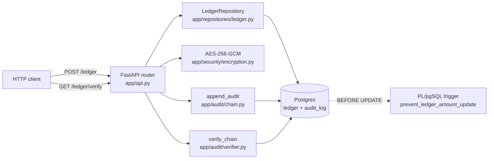
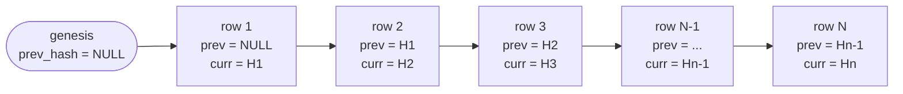
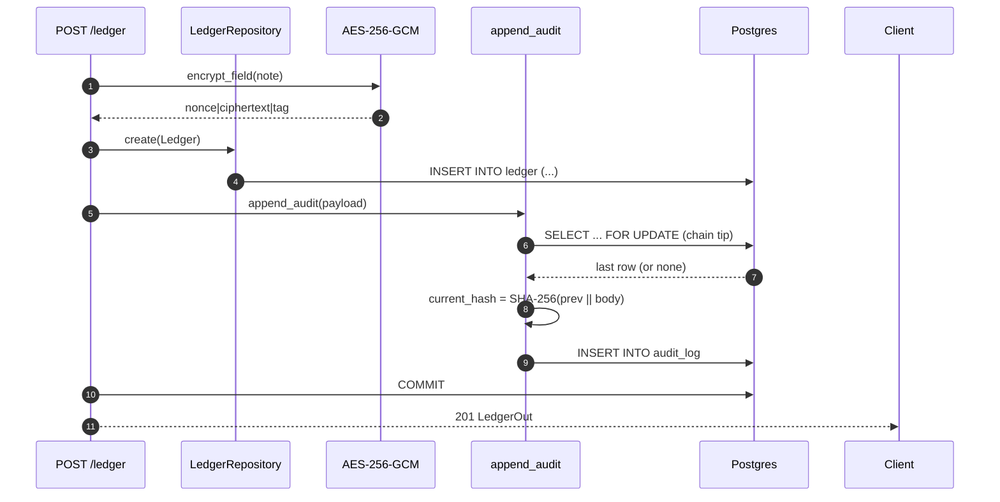
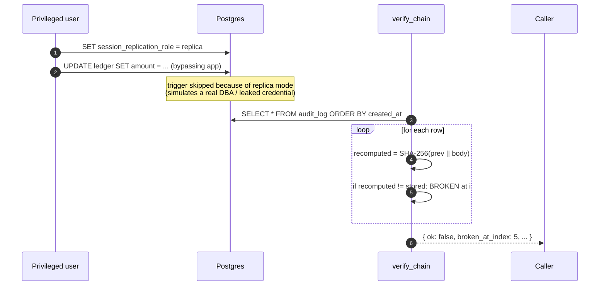

# Architecture

A bird's-eye view of how `tamper-evident-ledger` produces — and verifies —
tamper-evident audit logs.

## Component map



The repo guard (Python) and the trigger (PL/pgSQL) protect the **same**
columns. The repo gives a friendly error to honest callers; the trigger
catches everyone else.

## Hash chain — one link per row



For each link:

```
current_hash = SHA-256( prev_hash || canonical_json(body) )
```

`canonical_json` is `json.dumps(body, sort_keys=True, separators=(",",":"), default=str)`.

## Append flow — one row, one transaction



`SELECT ... FOR UPDATE` on the chain tip is what guarantees two parallel
appenders can't fork the chain. Both writes are in the same transaction, so
an audit row can never exist without its ledger row.

## Tamper detection flow



Even when the trigger is bypassed, the chain still detects the edit: the
audit-log row for the tampered ledger row remains the same, so its body no
longer matches reality — and even if the attacker also tampers with the
audit row, the next link's `prev_hash` no longer matches.

To hide *one* edit cleanly, the attacker has to rewrite every audit-log row
from that point forward. That's a much taller bar — and pairs naturally
with off-site verification, WORM storage, or RFC 3161 timestamps. See
[threat-model.md](threat-model.md).
